# Pie Draw

A browser-based 2D **drawing** app. Features a context-aware **pie menu** for most actions. Shapes and freehand strokes are vector objects that can be selected, moved, scaled, and recolored. There is no pixel-level editing.

## Running It

```bash
npm install
npm run dev
npm run build     # Production build
```

Use **Chrome or Edge** on a desktop computer for the full experience.

Click **Help** in the app for a list of possible actions. Keyboard shortcuts use Ctrl on Windows/Linux. On MacOS, Cmd and Ctrl both work.

## Features

### Pie Menu

<!-- pie-menus:start (generated by `npm run docs:pies`) -->
|  |  |
| :-: | :-: |
| Nothing selected | Object selected |
<!-- pie-menus:end -->

Right-click, or left-press-and-hold for ~300 ms, to open a radial menu centered on the pointer. This works the same in every tool. Pressing **M** also opens it.

- **Context-aware.** The menu changes based on the target: an empty canvas, an object, or multiple objects.
- **Fixed layouts.** Each option always sits in the same place, so choices can be made from memory.
- **Submenus** open in an outer ring, reached in the same stroke as the first choice.
- **Keyboard.** The menu can be opened, navigated, and used without a mouse.

### Drawing and Editing

- **Create shapes** from the empty-canvas menu. The shape appears where the menu was opened.
- **Freehand drawing** with live shape recognition. If a stroke closes into a recognized shape, a **preview** of that shape appears. Release to snap to that shape.
- **Object manipulation.** Select, move, and scale objects directly, by mouse, trackpad, or keyboard.
- **Multi-select.** Select several objects by clicking or with a selection box. A multi-selection acts as one object: moving, scaling, and recoloring affects all selected objects.
- **Cut, copy, and paste**, **z-order** (To Front / To Back), an **eraser tool**, and **undo / redo**.

### Color

Two swatches show the **line color** and **fill color**, with five colors available for each. The swatches indicate the color of the selected shape or, with nothing selected, the color new shapes will get. Colors can be picked from the swatches, by dragging a swatch onto a shape, or from the shape menu's Line / Fill submenus.

### Navigation

An infinite canvas with map-style navigation. Pan and zoom with the mouse, a trackpad, or the keyboard.

### Files

Saving and opening files can be done through the **File** menu in the toolbar. Documents are saved as JSON (`{ "version": 1, "shapes": [...] }`) and validated when opened. Unsaved work is indicated with a blue dot next to the document title.

## Design Decisions

**Pie menu at the pointer instead of a toolbar.** A toolbar makes every command a trip to the screen edge. The pie menu opens where you're working, every item is equally close, and wedges widen as you move outward (Fitts' law). The cost is discoverability, which the empty-canvas prompt, status line and help panel offset.

**Direction, not distance, picks the item.** Only the angle counts, so each wedge is a large target. The slow, label-reading motion is the same one that later becomes a quick flick from memory, which is why layouts never change. About eight items fit per ring, so further commands go in a submenu ring.

**A visible way out.** Releasing on the center × or beyond the outer ring cancels, and both light up before you let go. The edge (~120 px, ~185 px on submenus) is still far larger than a toolbar button.

**Context instead of modes.** The menu shows only what applies under the pointer, so there are no disabled items. Dragging means *move* on a shape and *draw* on empty canvas. The trade-off is that a direction means different things in the two menus (↑ is Square on canvas, Line on a shape). The select, hand and eraser tools are the only modes; each is highlighted, changes the cursor and status line, and exits with its key or Esc. Outside them the cursor is a pen, since a drag draws. Opening the menu works the same in every mode.

**File commands in a conventional menu.** New, Open and Save are used rarely, so they don't earn a pie direction. Moving them to a File menu at the top left, where people expect it, freed a wedge and widened the rest. It opens on hover with a short grace period, or on click for touch and keyboard.

**Two ways to box-select.** A plain drag on empty canvas already draws, so box selection uses Shift-drag or the select tool. The box selects anything it *touches*, so a rough drag is enough, and touched shapes are outlined before release. The selected group's box then acts as one target for move, menu and scale. On a Mac, Ctrl-click is a right-click, so Cmd-click adds to the selection.

**Minimal, clustered chrome.** A thin top bar holds the document commands (File, Paste, Undo, Redo, Clear all, Help). Everything else sits in one lower-right stack (color swatches, select, hand, eraser, zoom) with large 48×44 px buttons, each with a keyboard or gesture equivalent.

**Color swatches that fan out.** Two swatches replace a permanent palette and are told apart by shape (ring vs. disc), not just label. Clicking fans the colors out in an arc that echoes the pie menu; dragging a swatch onto a shape recolors it without selecting it first.

**Ghost preview for recognition.** Instead of swapping your stroke on release, the recognized shape appears as a ghost *behind* what you're drawing, at the exact size it will snap to. It changes only after several consecutive frames agree, and ambiguous strokes stay freehand. Every primitive can also be created reliably from the menu.

**Feedback and discoverability.** A status line always says what you can do right now, in every state and tool. An empty canvas shows how to open the menu, and the help panel draws the real menu layouts.

**Direct manipulation and safe experimentation.** Shapes are moved and scaled by grabbing them, not through property panels. Every document change is undoable (one drag or pinch = one step), so Clear all and the eraser need no confirmation dialogs.

**Vector objects, one drawing style.** Every stroke is a selectable path object, like the primitives. All shapes share one line width; closed shapes can take a fill and are selectable by their interior even when outline-only.

## Limitations / Not Yet Implemented

- **Mobile and touch.** No support for touchscreen pinch-to-zoom or two-finger pan. Additionally, there is no alternate UI for small screens.
- **Browsers other than desktop Chrome/Edge.** Can save files, but Save downloads a new copy each time instead of overwriting the original.
- **Pie menu accessibility.** The menu works from the keyboard, but nothing is announced to screen readers.
- **Rotation.** Rotation of shapes is not supported.
- **Drawing capabilities.** One stroke width, a fixed five-color palette, no command to create straight lines.
- **Erasing.** There is no pixel-level erasing, by design.
- **Export and persistence.** No PNG/SVG export, no autosave.
